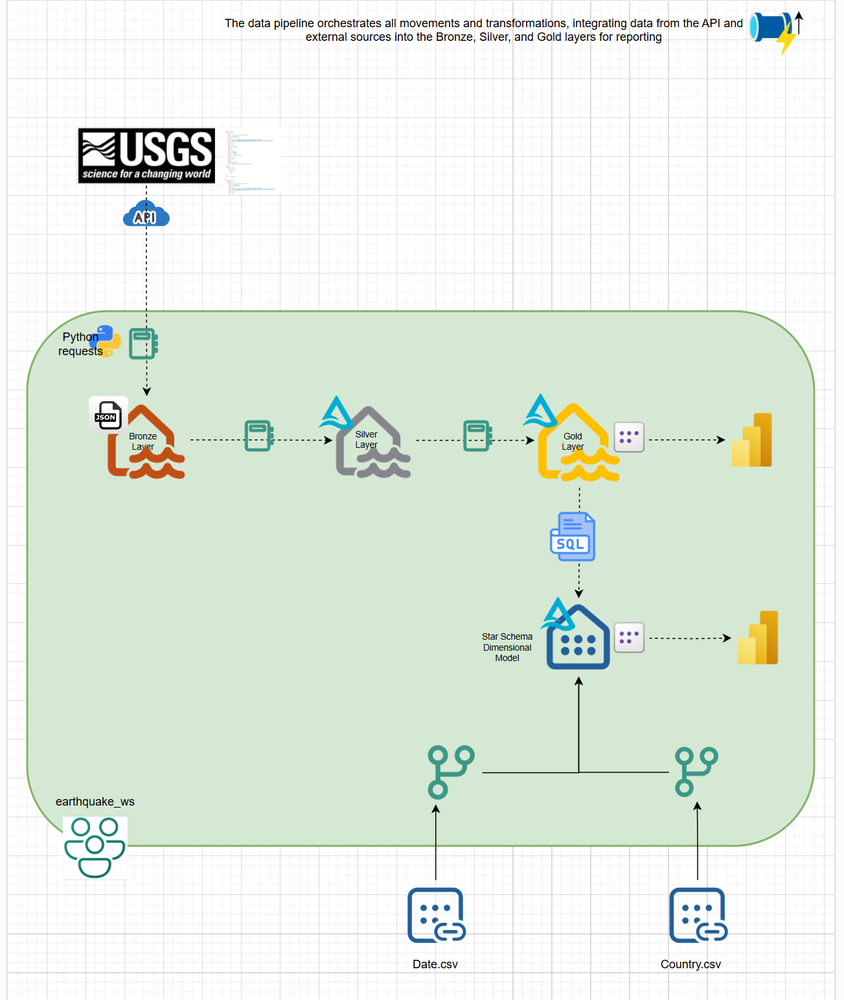
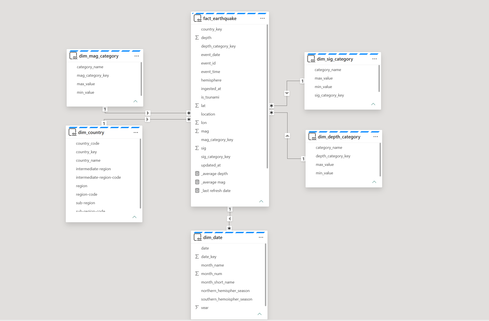
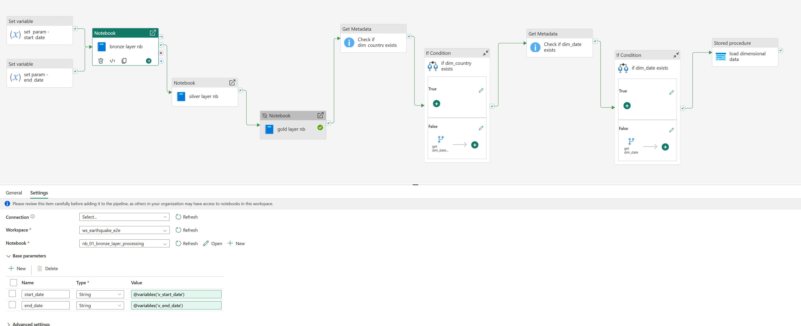

# fabric-earthquake-e2e 🌍

## Table of Contents
- [Project Overview](#project-overview)
- [Business Questions](#business-questions)
- [Architecture](#architecture)
- [Data Model](#data-model)
- [Data Pipeline](#data-pipeline--processing)
- [Dashboard](#dashboard-power-bi)
- [Repository Structure](#repository-structure)
- [Tech Stack](#tech-stack)

## Project Overview

This project explores global earthquake data using Microsoft Fabric. The data is sourced from the USGS Earthquake API and processed through an end-to-end data pipeline.

The solution follows a **Medallion Architecture (Bronze, Silver, Gold)** to progressively improve the structure, quality, and usability of the data. Raw API data is ingested into the Bronze layer, cleaned and enriched in the Silver layer, and transformed into curated analytics-ready tables in the Gold layer.

The final dataset is used to build a Power BI report that helps analyze earthquake activity by location, magnitude, depth, significance, and time.

**Data Source:**  
USGS Earthquake API  
https://earthquake.usgs.gov/fdsnws/event/1/

---
## Business Questions

The data model and reporting layer are designed to support analysis of global earthquake activity and answer questions such as:

- How does earthquake frequency change over time?
- Which countries experience the highest number of earthquakes?
- Which countries have the highest average earthquake magnitude?
- What is the distribution of earthquakes by depth category?
- What is the distribution of earthquakes by significance level?
- Which countries are associated with the most significant earthquake events?
- What are the most recent earthquake events?
- How are earthquake events geographically distributed across countries?
---
## Architecture

This project follows the Medallion Architecture pattern to structure data processing into three layers: Bronze, Silver, and Gold.

### Bronze — Raw Data
- Ingests earthquake data from the USGS API using a rolling 7-day window  
- Stores raw JSON snapshots in the Fabric Lakehouse  
- Preserves source structure with minimal transformation  
- Captures both new and updated events  

### Silver — Cleaned & Structured Data
- Flattens and standardizes the raw JSON data  
- Extracts key fields (magnitude, location, timestamps, coordinates)  
- Applies data quality validations (critical and non-critical checks)  
- Uses an upsert (merge) strategy to maintain a consolidated dataset  

### Gold — Analytics-Ready Data
- Enriches data for analytical use  
- Derives country from coordinates using reverse geocoding  
- Enriches the dataset with derived attributes (significance, depth)
- Produces a curated dataset optimized for reporting and Power BI  

**Environment Setup**
A dedicated Fabric environment is used to install the `reverse_geocoder` library, enabling derivation of `country_code` from geographic coordinates.

An architecture diagram is provided below to illustrate the end-to-end data flow.

---
## Data Model
The solution uses a star schema design to support efficient analytical queries.

- **fact_earthquake** contains event-level data (magnitude, time, location, depth, significance)
- Dimension tables provide descriptive context:
  - **dim_country**
  - **dim_mag_category**
  - **dim_depth_category**
  - **dim_sig_category**
  - **dim_date**

This structure enables flexible analysis across geographic, temporal, and categorical dimensions.

---
## Data Pipeline

The pipeline orchestrates the end-to-end data flow from ingestion to analytics using notebooks, dataflows, and a stored procedure.

> **Note (Design Simplification)**  
> The pipeline uses a rolling 7-day window (today-7 to today-1) to capture new and updated events.  
> Idempotency and full reprocessing logic are simplified for this project but would be required in a production setting.

### Bronze Layer (Notebook → Lakehouse)
- Extracts earthquake data from the USGS API using a rolling 7-day window  
- Stores raw JSON data in the Lakehouse  

### Silver Layer (Notebook → Lakehouse)
- Processes raw data from the Bronze layer  
- Applies transformations and data quality checks  
- Writes structured data to Silver tables  

### Gold Layer (Stored Procedure → Warehouse)
- Loads data from Silver into dimensional and fact tables  
- Uses a stored procedure to populate the analytical model  
- Stores data in the Warehouse for reporting and Power BI
  
- 

---
## Dashboard (Power BI)
The Power BI dashboard provides an interactive view of global earthquake activity.

Users can explore:
- Earthquake trends over time  
- Geographic distribution by country  
- Distribution by depth and significance  
- Recent and high-impact earthquake events  

The final dataset from the **Gold Layer** is used in **Power BI** to build dashboards and explore earthquake patterns and insights.

[🔗 View Interactive Dashboard](<your-public-link-here>)

---

